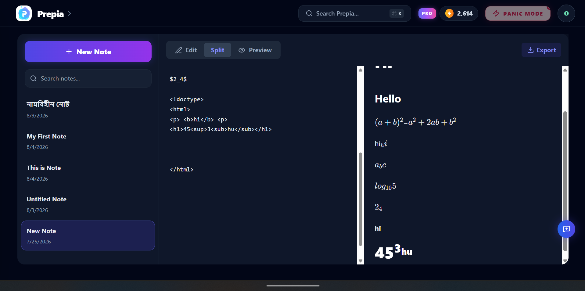
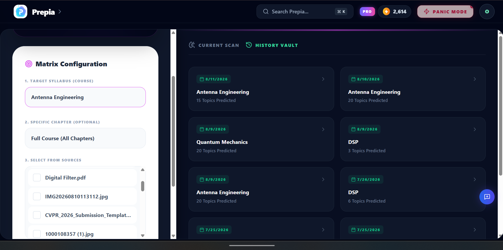
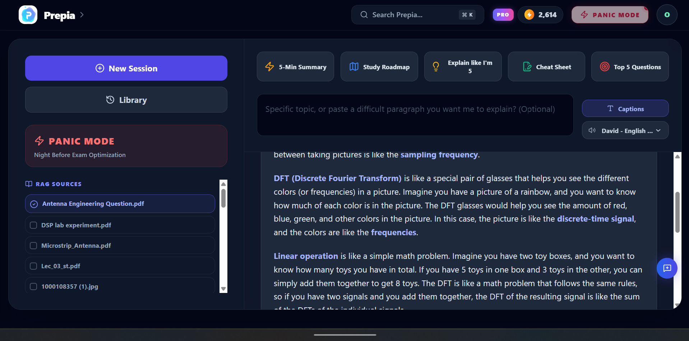
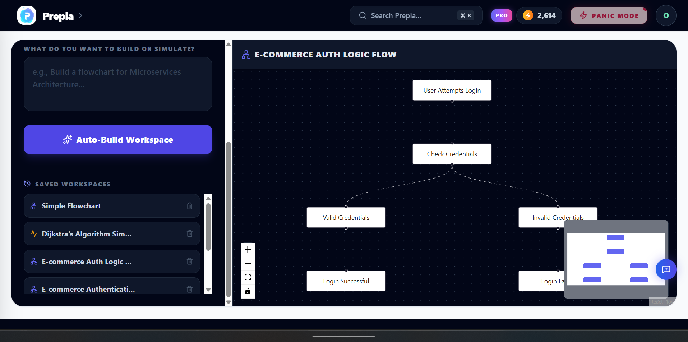
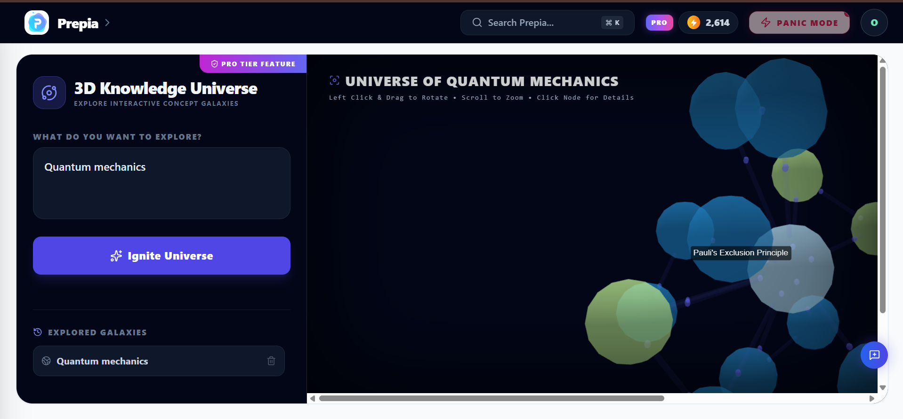
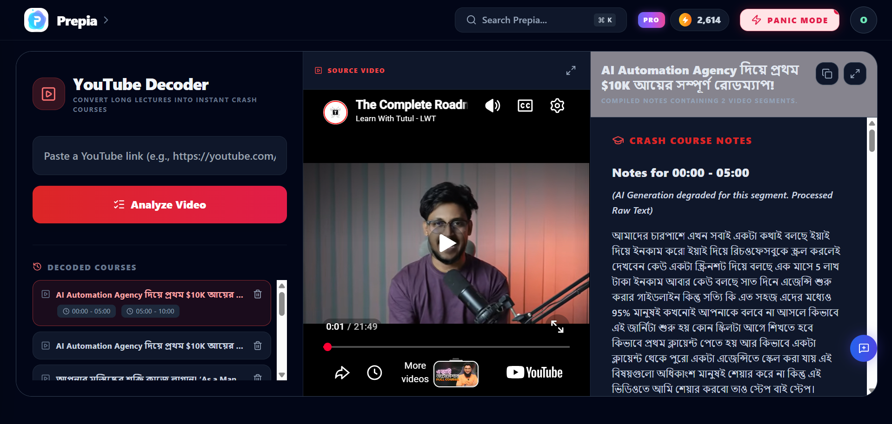
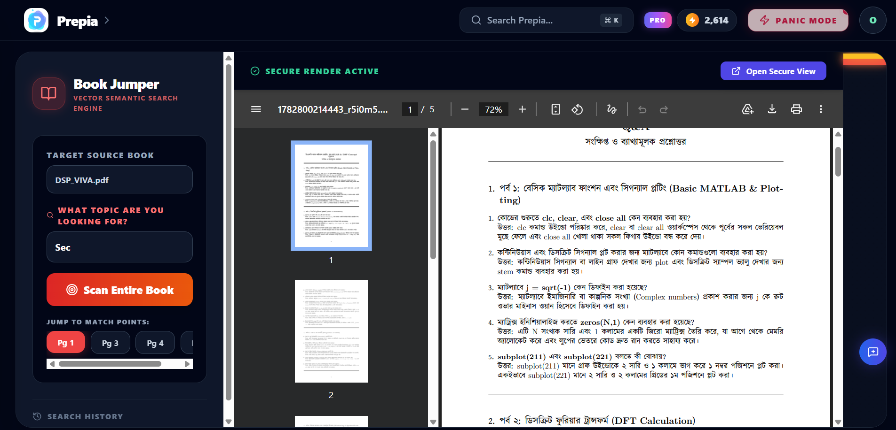
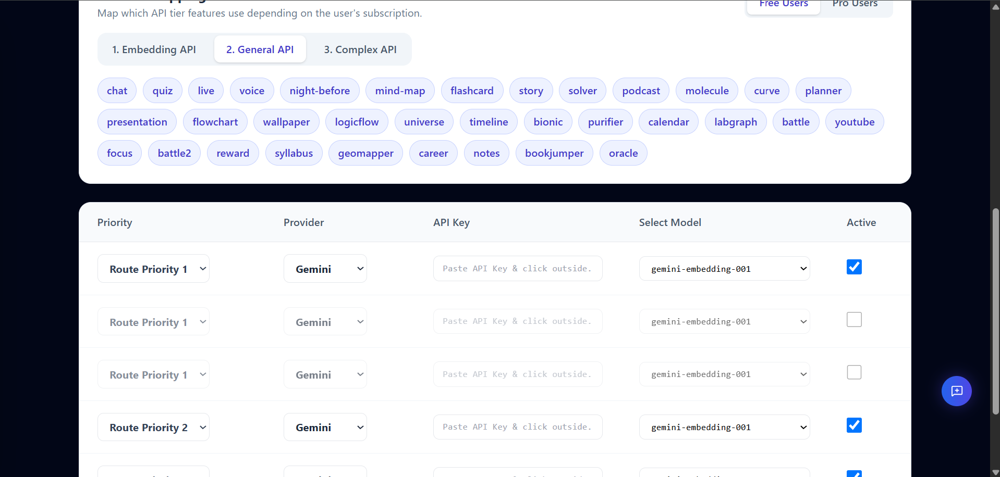

# StudyAI — AI-Native Learning Infrastructure for Students

> **Hackathon submission:** XPRIZE / Devpost  
> **Repository:** https://github.com/cryptXploit/StudyAI

StudyAI is a production-oriented, AI-native study platform designed around one principle:

> **Use AI where reasoning creates value; use deterministic software, retrieval, caching, workers, and fallbacks everywhere else.**

Instead of treating an LLM as the entire product, StudyAI combines LLMs with retrieval systems, mathematical algorithms, structured generation, Redis caching, background workers, object storage, database constraints, routing policies, and graceful degradation.

The result is a broad learning workspace covering document intelligence, exam preparation, multimodal solving, knowledge visualization, productivity, gamification, career assistance, audio/video learning, and operational administration.

This README intentionally separates **what is implemented** from **what is planned**. Performance, cost, reliability, and scale claims are architectural goals or observed design properties unless explicitly measured.


<p align="center">
  <a href="https://github.com/cryptXploit/StudyAI/blob/main/QUICK_START.md"></a>
  <a href="https://github.com/cryptXploit/StudyAI/blob/main/COMPLETE_DELIVERY_SUMMARY.md"></a>
  <a href="https://github.com/cryptXploit/StudyAI/blob/main/BULLMQ_WORKERS_QUICKSTART.md"></a>
  <a href="https://github.com/cryptXploit/StudyAI/blob/main/DOCUMENTATION_MASTER_INDEX.md"></a>
</p>

<p align="center">
  <a href="#ai-features">AI Features</a> ·
  <a href="#exam-intelligence">Exam Intelligence</a> ·
  <a href="#audio-and-video-learning">Audio/Video</a> ·
  <a href="#gamification-rewards-and-growth">Gamification</a> ·
  <a href="#admin-mission-control">Admin</a> ·
  <a href="#implemented-vs-future-work">Future Roadmap</a>
</p>

> **Judge note:** This README intentionally distinguishes implemented architecture from future extensions. Claims about performance, cost, availability, and scale are presented as engineering properties/design goals unless benchmarked.

---

## Table of Contents

- [Why StudyAI](#why-studyai)
- [Architecture at a Glance](#architecture-at-a-glance)
- [Technology Stack](#technology-stack)
- [System Architecture](#system-architecture)
- [File Upload to AI Pipeline](#file-upload-to-ai-pipeline)
- [AI Model Routing](#ai-model-routing)
- [RAG and Knowledge Retrieval](#rag-and-knowledge-retrieval)
- [Caching Strategy](#caching-strategy)
- [Background Jobs and BullMQ](#background-jobs-and-bullmq)
- [Storage and Database](#storage-and-database)
- [AI Features](#ai-features)
- [Exam Intelligence](#exam-intelligence)
- [Visual and Algorithmic Learning](#visual-and-algorithmic-learning)
- [Audio and Video Learning](#audio-and-video-learning)
- [Productivity and Learning Environment](#productivity-and-learning-environment)
- [Gamification, Rewards and Growth](#gamification-rewards-and-growth)
- [Career and Student Utilities](#career-and-student-utilities)
- [Admin Mission Control](#admin-mission-control)
- [Security and Reliability](#security-and-reliability)
- [Cost and Latency Engineering](#cost-and-latency-engineering)
- [Failure and Fallback Philosophy](#failure-and-fallback-philosophy)
- [Architecture Tree](#architecture-tree)
- [Implemented vs Future Work](#implemented-vs-future-work)
- [Known Limitations](#known-limitations)
- [Documentation Map](#documentation-map)
- [Local Development](#local-development)
- [Deployment Model](#deployment-model)
- [Engineering Philosophy](#engineering-philosophy)

---


<details>
<summary><strong>🧩 Implemented Feature Inventory — click to expand</strong></summary>

**Core intelligence:** AI Chat/Solver, RAG, Syllabus Quests, Story, Quiz, Flashcards, Molecule Insight, Oracle Exam Predictor, Night Before Exam, Notes Purifier, Flowchart, LogicFlow, YouTube Decoder, Podcast Room.

**Visual/cognitive:** Focus Island, Bionic Reader, Wallpaper Generator, GeoMapper, Knowledge Universe, Timeline.

**Productivity:** Study Planner, Calendar, Focus analytics, Book Jumper.

**Career:** Career Hacker / Pathway.

**Gamification/growth:** Aura, streaks, daily rewards, profile bounty, learning heatmap, referrals, Panic Mode, Neural Feed unlock paths, rewarded ads, Alumni Bounty.

**Commerce/account:** Free/Student/Pro feature mappings, pricing, payment verification, manual admin payment recovery, profile, feedback, legal/account surfaces.

**Platform:** Supabase/PostgreSQL + RLS, Cloudflare R2, Redis, BullMQ, Node.js/Express/TypeScript, Next.js/React/Tailwind, Docker, Kubernetes-oriented deployment, configurable multi-provider AI routing, streaming, fallbacks and structured-output validation.

</details>


# Why StudyAI

Most AI study applications follow a simple pattern:

```text
User → Prompt → LLM → Answer
```

StudyAI is intentionally different:

```text
User
  ↓
Product/UI constraints
  ↓
Validation + security
  ↓
Cache / deterministic path
  ↓
Retrieval / preprocessing
  ↓
Model Router
  ↓
Primary model
  ↓
Fallback / hedge / recovery
  ↓
Structured result
  ↓
Persistence + analytics
  ↓
UI / learning workflow
```

The architecture attempts to minimize unnecessary model calls while preserving useful AI capabilities.

### Core design goals

| Goal | Architectural approach |
|---|---|
| Lower AI cost | caching, truncation, deterministic processing, cheap-model routing, reuse of summaries |
| Lower latency | Redis cache, sequential bounded work, SSE, async jobs, precomputed data |
| Better reliability | provider fallback, graceful degradation, timeouts, circuit-breaker-style health logic |
| Better correctness | structured prompts, JSON/XML extraction, deterministic algorithms, retrieval constraints |
| Lower server pressure | BullMQ workers, bounded concurrency, object storage, chunking |
| Vendor flexibility | database-driven model/provider routing |
| Better UX | streaming, background processing, saved results, gamification |
| Security | validation, authorization, hashing, idempotency, injection filtering |
| Scalability | stateless API direction, Redis, queues, object storage, modular services |

---

# Architecture at a Glance

```text
                         ┌──────────────────────────┐
                         │       React / Next.js    │
                         │ Tailwind CSS UI / i18n   │
                         └────────────┬─────────────┘
                                      │
                         HTTPS / SSE / API requests
                                      │
                    ┌─────────────────▼─────────────────┐
                    │          Node.js Backend          │
                    │ Controllers / Services / Auth     │
                    └───────┬───────────────┬───────────┘
                            │               │
                 ┌──────────▼──────┐   ┌──▼────────────────┐
                 │   Model Router   │   │ Retrieval Service │
                 │ priority/fallback│   │ chunks/embeddings │
                 └───────┬──────────┘   └──────┬────────────┘
                         │                     │
          ┌──────────────┼─────────────┐       │
          │              │             │       │
       Gemini          Groq        Other       │
       /Google       /providers    providers   │
          │              │             │       │
          └──────────────┴─────────────┘       │
                                               │
                    ┌──────────────────────────▼───────────┐
                    │              Redis                    │
                    │ cache / queues / job coordination    │
                    └────────────────────┬──────────────────┘
                                         │
                                  BullMQ Workers
                                         │
             ┌───────────────────────────┼──────────────────────────┐
             │                           │                          │
       Document jobs              AI generation              Notifications
             │                           │                          │
             └───────────────────────────┬──────────────────────────┘
                                         │
                         ┌───────────────▼────────────────┐
                         │            Supabase            │
                         │ PostgreSQL / Auth / persistence│
                         └───────────────┬────────────────┘
                                         │
                         ┌───────────────▼────────────────┐
                         │        Cloudflare R2            │
                         │ PDFs / images / uploaded files  │
                         └─────────────────────────────────┘
```

---

# Technology Stack

## Frontend

- React
- Next.js
- Tailwind CSS
- Streaming/SSE-compatible UI flows
- Internationalized UI/content handling
- Interactive visualizations
- React Flow / Mermaid-style flow rendering
- 3D knowledge visualization
- Responsive study workspace

## Backend

- Node.js
- TypeScript
- REST-style controllers
- Server-Sent Events (SSE) for streaming experiences
- Modular controller/service architecture
- Model routing abstraction
- Retrieval services
- Background job processing

## Data and infrastructure

- Supabase / PostgreSQL
- Redis
- BullMQ
- Cloudflare R2
- Docker
- Kubernetes-oriented deployment architecture
- Optional n8n notification routing
- Vercel/Docker-compatible frontend deployment

## AI / ML layer

- Gemini and other configurable providers
- Embeddings / vector retrieval
- RAG
- Task-specific model routing
- Cheap-model paths for simple transformations
- Higher-capability paths for complex reasoning
- Structured generation
- Multimodal input handling

---

# System Architecture

StudyAI is organized around several boundaries.

### 1. Experience layer

The frontend owns:

- navigation
- study workflows
- streaming states
- visualizations
- interactive quizzes
- flashcards
- planners
- exam preparation
- 3D knowledge maps
- focus experiences

### 2. API layer

Controllers validate requests and coordinate:

- authentication/authorization
- feature access
- token/credit rules
- retrieval
- AI generation
- persistence
- streaming
- job submission

### 3. Intelligence layer

The AI layer is not directly exposed to controllers as a hard-coded provider.

Instead:

```text
Feature
   ↓
Task type
   ↓
Tier
   ↓
Model Router
   ↓
Provider priority
   ↓
Health / timeout / fallback
```

This makes the provider an implementation detail rather than a product dependency.

### 4. Data layer

Supabase is used for persistent application state.

Redis is used for low-latency transient state and caching.

Cloudflare R2 is used for object/file storage, while file metadata and references are persisted in Supabase.

---

# File Upload to AI Pipeline

One of the most important architectural paths is the document pipeline.

```text
User selects file
       ↓
Frontend validation / limits
       ↓
Backend validation
       ↓
Magic-number / file-type validation
       ↓
Cloudflare R2 upload
       ↓
File metadata + object reference → Supabase
       ↓
202 Accepted where asynchronous processing is appropriate
       ↓
BullMQ job
       ↓
Document worker
       ↓
Extraction / OCR
       ↓
MarkItDown / parser path
       ↓
Gemini Vision fallback where required
       ↓
Chunking
       ↓
Embeddings
       ↓
Vector retrieval index
       ↓
Global summary / derived metadata
       ↓
Flashcards / learning artifacts
       ↓
Ready for RAG-powered features
```

### Why this matters

The API server does not need to perform every expensive operation synchronously.

Heavy work can be moved to workers, allowing the request/response path to remain smaller and more predictable.

### Processing strategy

The ingestion layer is designed to:

- validate files before processing
- keep large objects out of the relational database
- store object references rather than large binary payloads
- extract text before expensive reasoning
- chunk documents for retrieval
- create embeddings once and reuse them
- generate reusable summaries
- make later features operate over derived knowledge rather than repeatedly processing the original document

---

# AI Model Routing

StudyAI uses a database-driven model routing approach.

The administrator can configure providers/models and their priorities without requiring a source-code change for every provider switch.

Conceptually:

```text
Request
  ↓
Task classification
  ↓
Tier / entitlement
  ↓
Configured provider candidates
  ↓
Health + priority + latency budget
  ↓
Fastest valid provider
  ↓
Fallback if required
```

### Task-aware routing

Different workloads do not require the same model.

Examples:

```text
simple transformation
        → inexpensive / fast model

structured quiz generation
        → deterministic low-temperature model

complex reasoning
        → stronger model

embeddings
        → embedding-specific provider/model

classification
        → classifier-capable model
```

### Provider independence

The system is designed so Gemini, Groq, DeepSeek, or other configured providers can be changed at the operational layer.

This reduces vendor lock-in and makes price/performance tuning possible over time.

### Configuration safety

The routing layer contains defensive behavior for invalid model assignments. For example, a classification/guard model should not accidentally become the general chat model simply because of an administrative configuration mistake.

---

# RAG and Knowledge Retrieval

RAG is central to StudyAI's document intelligence.

```text
Uploaded document
      ↓
Extracted text
      ↓
Chunks
      ↓
Embeddings
      ↓
Vector store
      ↓
Query
      ↓
Relevant chunks
      ↓
Optional filtering / reranking
      ↓
Prompt context
      ↓
LLM
```

### Why RAG instead of sending entire documents?

Because repeatedly sending a 500-page or 2,000-page document to an LLM is expensive and inefficient.

RAG allows the system to retrieve only the information relevant to a request.

### RAG-powered areas

- Solver
- Story
- Quiz
- Flashcards
- Night Before Exam
- Career assistance
- Book Jumper
- document-based chat
- knowledge/learning features

### Retrieval constraints

Several features additionally impose:

- character limits
- syllabus/course restrictions
- chapter restrictions
- selected-file restrictions
- language constraints

This reduces irrelevant context and improves cost control.

---

# Caching Strategy

Caching is treated as a first-class architecture component.

## Exact / deterministic caching

Suitable for:

- identical flashcard requests
- repeated molecule insights
- repeated concept comparisons
- generated summaries
- repeated study artifacts

## Semantic caching — future / extensible layer

A semantic cache can eventually recognize that:

```text
"Generate flashcards for Biology"
```

and

```text
"Create study cards from Biology"
```

may represent substantially the same intent.

A future semantic cache can use embeddings to avoid unnecessary regeneration.

### Cache philosophy

```text
Can this answer be reused?
        ↓ yes
Return cached result

        ↓ no
Can deterministic logic solve it?
        ↓ yes
Solve locally

        ↓ no
Retrieve relevant context

        ↓
Call appropriate model
```

This is one of the core ways StudyAI attempts to keep AI usage proportional to actual intelligence required.

---

# Background Jobs and BullMQ

Heavy workloads can be processed asynchronously through BullMQ/Redis.

Typical worker-oriented jobs include:

- document ingestion
- OCR/extraction
- embeddings
- long-form AI processing
- large YouTube/audio processing
- notification jobs
- generated artifact persistence
- long-running study packages

Conceptual flow:

```text
API request
   ↓
Validate
   ↓
Create job
   ↓
BullMQ / Redis
   ↓
Worker
   ↓
Process
   ↓
Persist
   ↓
Notify / expose result
```

### Why workers?

They prevent expensive tasks from monopolizing HTTP request lifetimes.

They also make it possible to add:

- retries
- backoff
- bounded concurrency
- queue prioritization
- worker scaling
- separate compute pools

without rewriting the product layer.

---

# Storage and Database

## Supabase

Supabase/PostgreSQL acts as the persistent application database.

It stores areas such as:

- users/profile state
- feature results
- document metadata
- file references
- generated artifacts
- rewards
- referrals
- payments
- planner/calendar data
- learning progress
- molecule insights
- history
- feature mappings
- API configurations

Database-level constraints/RPC patterns are also used where atomicity matters.

## Cloudflare R2

Large uploaded objects are kept in object storage rather than bloating relational rows.

The architecture is:

```text
File
 ↓
Cloudflare R2
 ↓
Object URL/key
 ↓
Supabase metadata row
```

This separates binary storage from application state.

---

# AI Features

## 1. AI Chat

The chat architecture supports:

- streaming responses
- SSE
- Redis caching
- tier-aware model routing
- context truncation
- language constraints
- syllabus-aware context
- fallback providers
- multimodal/solver-style inputs where applicable
- success-aware credit handling

The objective is to avoid turning every request into an expensive unrestricted LLM call.

---

## 2. Story Generator

The Story feature converts study material into educational narrative.

Important characteristics:

- educational concepts are embedded into stories
- prompt rules avoid generic AI introductions
- retrieved material can constrain the story
- language follows the selected language
- context is truncated before generation
- generated output can be streamed

The goal is not simply "AI writes a story", but:

```text
Study material
   ↓
Relevant context
   ↓
Narrative transformation
   ↓
Learning through story
```

---

## 3. Quiz Generator

The Quiz engine supports structured interactive quiz generation and LaTeX-oriented exam output.

Design characteristics:

- low temperature for structured output
- JSON-compatible schema
- stable English object keys for frontend compatibility
- translated values
- unnecessary document metadata can be excluded
- LaTeX mode can produce exam-ready material

---

## 4. Flashcards

Flashcards use an Anki-style learning workflow.

The generated result can include:

- question
- answer
- highlighted difficult terms
- glossary
- language-aware content

Redis caching reduces repeated generation.

---

## 5. Molecule Insight / Chemistry Lab

The molecule feature provides contextual educational information such as:

- medical relevance
- historical discovery
- hazard/warning information
- molecule-specific insight

Previously generated molecule information can be persisted and reused rather than regenerated for every request.

---

# Exam Intelligence

## Oracle — Exam Predictor

Oracle is intentionally hybrid rather than fully LLM-dependent.

### Current approach

Historical/available questions are processed using cosine similarity and clustering logic.

Conceptually:

```text
Question set
    ↓
Vector/similarity comparison
    ↓
Similarity threshold
    ↓
Clusters
    ↓
Frequency
    ↓
Confidence score
    ↓
Exam prediction
```

This is valuable because clustering and frequency analysis do not require an LLM call for every question.

### Fallback

If structured AI output fails, the system can construct a usable response from clustered/raw information instead of returning a blank result.

### Important limitation

The predictor is an analytical prioritization tool, not a guarantee of what will appear in an exam. Confidence should be interpreted as a ranking signal derived from available data, not statistical certainty about future exam papers.

---

# Night Before Exam

Night Before Exam is a multi-action exam preparation engine.

Supported modes include:

1. Roadmap
2. Real-life / simplified explanations
3. Dense cheat sheet
4. Top probable questions
5. Five-minute condensed summary

### Cost-aware design

When a user requests a broad review without a narrow topic, precomputed `global_summary` data can be reused instead of performing unnecessary retrieval work.

The cache key can incorporate dimensions such as:

```text
action
topic
file IDs
language
courses
chapters
topics
```

This prevents unrelated requests from sharing incorrect cached answers.

### Context control

Large inputs are bounded before reaching the model.

This is deliberate: a smaller relevant context is generally cheaper and easier for a model to reason over than an unrestricted document dump.

---

# Notes Purifier

Notes Purifier transforms noisy study input into structured study material.

Useful for:

- OCR output
- poorly formatted notes
- broken line structure
- inconsistent wording

The processing can:

- generate a title
- normalize formatting
- emphasize important keywords
- produce a cleaner study document

The feature is intentionally suitable for cheaper text-processing models because it is primarily a transformation task rather than an open-ended reasoning task.

---

# Flowchart Generator

The Flowchart feature transforms logic/code into Mermaid-style flow representations.

Engineering details include:

- input length limits
- JSON extraction
- control-character cleanup
- protection against model chatter around the expected output
- persistence of generated flowcharts

The architecture treats structured parsing as a defensive boundary between probabilistic model output and deterministic frontend rendering.

---

# LogicFlow

LogicFlow has two complementary learning modes.

## Algorithm Animator

Algorithms such as sorting can be represented step-by-step.

The model produces structured state transitions so the frontend can animate:

```text
Initial array
 → comparison
 → swap
 → comparison
 → swap
 → final array
```

This changes algorithm learning from static explanation to state-based visualization.

## Graph Mode

Logic/decision structures can be converted into graph nodes.

Layout logic is handled deterministically where possible so that the frontend receives usable positions instead of relying entirely on visual guesswork from the LLM.

### Recovery

Malformed structured output such as trailing commas can be sanitized before parsing.

---

# Audio and Video Learning

## YouTube Decoder

YouTube processing is built as a fault-tolerant transcript acquisition pipeline.

The current architecture can attempt multiple sources in sequence:

```text
RapidAPI
   ↓
yt-dlp
   ↓
Piped instances
   ↓
Invidious instances
```

The exact availability of external providers is inherently outside StudyAI's control, so this should be understood as a multi-source fallback strategy rather than a guarantee that every video will always decode.

### Transcript processing

```text
Transcript
   ↓
cleanup
   ↓
spam/filler filtering
   ↓
5-minute chunks
   ↓
bounded context
   ↓
AI notes
   ↓
merged result
```

If a particular chunk fails, graceful degradation can preserve raw transcript content rather than discarding the entire video result.

---

## Audio Summary / Podcast

The podcast workflow can transform learning material into a dialogue-oriented audio script.

The architecture uses:

- chunked processing
- sequential generation
- structured output extraction
- TTS fallback behavior

Where a preferred TTS path is unavailable, an alternate TTS route can preserve the user-facing functionality.

The design favors continuity over dependence on one external voice provider.

---

# Productivity and Learning Environment

## Magic Study Planner

The planner converts:

```text
topics + available days
```

into a structured study schedule.

The backend constrains:

- date format
- time format
- input size

Longer planning workloads can be moved toward asynchronous processing as scale increases.

---

## Calendar

Calendar functionality stores and exposes generated study schedules.

### Future direction

Native Google/Apple calendar synchronization can eventually turn generated study plans into real calendar events and reminders.

---

## Focus Island

Focus Island provides focused study sessions and collaborative study-room primitives.

The architecture includes:

- focus-session logging
- lightweight room-code generation
- low-blocking persistence behavior

The current design prioritizes immediate UX response for session completion.

---

## Bionic Reader

Bionic Reader modifies reading presentation to make important portions visually easier to scan.

Large payloads are bounded to protect server memory and processing time.

---

## Wallpaper Generator

Wallpaper generation intentionally avoids a paid image-generation dependency.

Instead:

```text
Parameters
  ↓
SVG generation
  ↓
Typography/math-based composition
  ↓
Sharp
  ↓
PNG
```

This is a deterministic local-generation path.

Memory-conscious Sharp settings further reduce the risk of uncontrolled image-processing concurrency.

---

# Visual Knowledge Features

## Knowledge Universe

Knowledge Universe represents concepts as a graph:

```text
        Concept A
        /       \
   Concept B   Concept C
        \       /
          Core
```

Structured `nodes` and `links` output can be rendered in a 3D graph interface.

The feature turns relationships between learning concepts into an explorable visual structure.

---

## Geo Mapper

Geo Mapper combines AI interpretation with deterministic frontend visualization metadata.

The system can:

- route through configured providers
- apply prompt-injection filtering
- produce geographic/topic metadata
- generate visualization-oriented color information

### Future direction

A future GeoJSON pipeline could move from country-level metadata toward deterministic polygon rendering for regions/cities.

---

## Timeline

Timeline generation uses strict structured output rules and backend sanitation to prevent malformed historical content from breaking JSON consumers.

---

# Career and Student Utilities

## Career Hacker / Career Pathway

Career assistance combines:

```text
Target company/context
        +
Relevant user material
        ↓
Retrieval
        ↓
LLM matching
        ↓
Customized career output
```

A notable UX design is language separation:

- professional outreach can remain in English
- explanatory career guidance can follow the user's selected language

---

## Book Jumper

Book Jumper demonstrates the value of deterministic retrieval.

Instead of asking an LLM to inspect an entire book just to locate topics:

```text
Query
 ↓
Vector search
 ↓
Relevant chunks
 ↓
Page metadata extraction
 ↓
Heatmap
```

AI is used only when the user explicitly asks for deeper explanation.

This is a strong example of the product principle:

> **Do not spend inference budget solving a retrieval problem.**

---

# Gamification, Rewards and Growth

## Syllabus Quests

Syllabus Quests converts a syllabus into a structured learning journey.

### Global syllabus cache

Identical syllabus PDFs can be identified using a content hash and reused where appropriate.

### Progress rewards

Completing chapters can award Aura points.

Database-level protections help prevent duplicate reward farming.

---

## Daily Rewards and Streaks

The reward system supports:

- welcome rewards
- daily rewards
- streak bonuses
- profile completion rewards

These mechanisms are intended to encourage consistent study behavior.

---

## GitHub-style Learning Heatmap

Learning activity can be represented as a calendar heatmap.

Instead of returning unnecessary database payloads, the backend can fetch compact timestamp information and aggregate counts in application logic.

---

## Referral System

The referral system includes:

- referral codes
- anti-self-referral logic
- atomic database updates
- reward tracking
- feature unlock pathways

Some gated experiences can use referral milestones as an alternative path to access.

---

## Rewarded Ads

The rewarded-ad flow uses signed tickets and server-side time validation.

Conceptually:

```text
Start ad
  ↓
Signed ticket
  ↓
Timer requirement
  ↓
Claim
  ↓
Server validates ticket + elapsed time
  ↓
Reward
```

This is designed to make trivial client-side reward spoofing harder.

It is not presented as mathematically impossible to abuse; production anti-fraud systems generally require layered monitoring.

---

# Family Plan / Alumni Bounty

Family invitation codes are hashed before persistence rather than stored as plain-text secrets.

This limits the value of a database leak involving unused invitation codes.

Atomic entitlement logic can then control membership changes.

---

# Payments and Monetization

StudyAI includes a Bangladesh-oriented payment workflow.

The payment controller can process transaction messages and extract identifiers such as TrxID/TxnID and amounts.

### Payment lifecycle

```text
Payment
 ↓
SMS/webhook
 ↓
Transaction extraction
 ↓
Pending record
 ↓
User claim
 ↓
Verification
 ↓
Entitlement update
```

An administrative manual verification path exists for cases where automated payment processing is unavailable.

---

# Multi-Language AI

StudyAI uses prompt-level language control for generated learning content.

Instead of maintaining thousands of duplicated AI-output translations, the model is instructed to generate values in the requested language while keeping machine-readable schema keys stable.

Example:

```json
{
  "question": "...translated value...",
  "options": ["...", "..."],
  "answer": "..."
}
```

The keys remain stable for frontend compatibility.

This approach reduces translation maintenance for AI-generated content, although UI chrome still requires conventional localization where applicable.

---

# Admin Mission Control

The admin section is not only an analytics/dashboard layer.

It is an operational control plane.

## Dynamic API Configuration

Administrators can configure:

- providers
- models
- priorities
- active/inactive status
- task types

This allows operational provider changes without requiring a source-code deployment for every model switch.

---

## Feature Tier Mapping

Feature access can be mapped to tiers such as:

- Free
- Student
- Pro

This makes entitlement policy configurable instead of hard-coding every paywall into individual feature controllers.

---

## Latency Budgets

The routing layer can apply tier-aware latency budgets.

If a provider exceeds its allowed response window, the architecture can move toward a fallback rather than keeping the request waiting indefinitely.

The exact budget is a policy decision, not a guarantee of end-to-end latency.

---

## Hedged Requests

For selected higher-priority workloads, the router can use hedging:

```text
Provider A ────────┐
                   ├── first acceptable response
Provider B ────────┘
```

This can reduce tail latency at the cost of additional provider usage.

Therefore, hedging should be applied selectively rather than universally.

---

## Health and Fallback Philosophy

The router is designed around:

```text
Primary
 ↓
Health check / timeout
 ↓
Fallback
 ↓
Last-resort behavior
```

This reduces dependency on a single AI provider.

---

# Security and Reliability

StudyAI applies multiple layers of defensive engineering.

## Input controls

- input length limits
- file validation
- magic-number validation
- control-character cleanup
- structured-output extraction
- prompt-injection filtering in selected features

## Authentication / authorization

- protected routes
- tier-aware access
- server-side entitlement checks
- admin-only operations

## Idempotency

Credit/token mutations use idempotency concepts so retries do not automatically become duplicate charges.

Where applicable, token/credit deduction is tied to successful processing rather than merely the request starting.

## Database atomicity

Referral/reward workflows use atomic update patterns to prevent duplicate claims and race-condition-based reward farming.

## Timeouts

Long-running AI operations are bounded by explicit timeouts.

## Graceful degradation

Where possible:

```text
AI failure
 ↓
fallback provider
 ↓
cached result
 ↓
deterministic result
 ↓
raw/source result
```

The objective is not "never fail"; it is:

> **Fail narrowly, recover when possible, and preserve useful work.**

---

# Cost and Latency Engineering

Cost optimization is not one feature. It is a system-wide policy.

## 1. Deterministic before probabilistic

If a task can be solved with:

- regex
- SQL
- vector search
- hashing
- counting
- clustering
- local SVG generation
- metadata parsing

there is little reason to call an LLM.

Examples:

- Book Jumper page heatmaps
- Wallpaper generation
- Oracle clustering
- metadata extraction
- text cleanup
- page number extraction

---

## 2. Cache before inference

```text
Request
 ↓
Cache?
 ├─ yes → return
 └─ no → continue
```

Repeated AI work is one of the easiest places to remove unnecessary cost.

---

## 3. Retrieve before generation

Rather than sending entire files to a model:

```text
Large document
 ↓
Vector retrieval
 ↓
small relevant context
 ↓
LLM
```

---

## 4. Truncate aggressively but intentionally

Features use bounded contexts to prevent accidental token explosions.

The limitation is deliberate: context limits must eventually be replaced by hierarchical summarization for extremely large documents rather than simply discarding information.

---

## 5. Use the smallest capable model

Simple transformations do not need the same model as complex reasoning.

The router allows this distinction.

---

## 6. Sequential bounded processing

For some long-running workloads, sequential processing is preferred over unconstrained `Promise.all`.

Trade-off:

```text
parallel = potentially faster, higher concurrency pressure
sequential = slower wall-clock, more predictable resource usage
```

The architecture chooses stability where uncontrolled concurrency could exhaust memory or provider rate limits.

---

# Failure and Fallback Philosophy

StudyAI repeatedly uses a layered fallback model.

### Example

```text
                    ┌───────────────┐
                    │ Primary path  │
                    └───────┬───────┘
                            │ fail
                    ┌───────▼───────┐
                    │ Cached path   │
                    └───────┬───────┘
                            │ miss
                    ┌───────▼───────┐
                    │ Provider #2   │
                    └───────┬───────┘
                            │ fail
                    ┌───────▼───────┐
                    │ Deterministic │
                    │ / raw fallback│
                    └───────────────┘
```

Examples include:

- Gemini → alternate model/provider
- preferred TTS → alternate TTS
- YouTube transcript provider → alternate transcript source
- AI JSON → sanitized extraction
- AI output → raw content fallback
- cached result → fresh generation

This pattern is especially important for a hackathon project because it demonstrates system-level engineering rather than dependency on a single successful API call.

---

# Architecture Tree

The following is a conceptual architecture tree rather than a claim that every directory below has exactly this name in the repository.

```text
StudyAI/
├── frontend/
│   ├── app/                     # Next.js application
│   ├── components/              # reusable UI
│   ├── features/                # study feature interfaces
│   ├── hooks/
│   ├── lib/
│   ├── i18n/
│   └── styles/
│
├── backend/
│   └── src/
│       ├── controllers/
│       │   ├── admin.controller.ts
│       │   ├── battle.controller.ts
│       │   ├── bionic.controller.ts
│       │   ├── bookjumper.controller.ts
│       │   ├── calendar.controller.ts
│       │   ├── career.controller.ts
│       │   ├── family.controller.ts
│       │   ├── feedback.controller.ts
│       │   ├── flowchart.controller.ts
│       │   ├── focus.controller.ts
│       │   ├── gamification.controller.ts
│       │   ├── geomapper.controller.ts
│       │   ├── logicflow.controller.ts
│       │   ├── molecule.controller.ts
│       │   ├── night.controller.ts
│       │   ├── oracle.controller.ts
│       │   ├── payment.controller.ts
│       │   ├── planner.controller.ts
│       │   ├── podcast.controller.ts
│       │   ├── profile.controller.ts
│       │   ├── purifier.controller.ts
│       │   ├── reward.controller.ts
│       │   ├── syllabus.controller.ts
│       │   ├── timeline.controller.ts
│       │   ├── universe.controller.ts
│       │   └── youtube.controller.ts
│       │
│       ├── services/
│       │   ├── retrieval/
│       │   ├── model routing/
│       │   ├── embeddings/
│       │   ├── caching/
│       │   ├── storage/
│       │   ├── document processing/
│       │   └── notifications/
│       │
│       ├── workers/
│       │   ├── document workers
│       │   ├── AI generation workers
│       │   ├── notification workers
│       │   └── long-running jobs
│       │
│       ├── modelRouter.ts
│       └── ...
│
├── docker/
├── k8s/
├── docs/
├── QUICK_START.md
├── FRONTEND_COMPLETE.md
├── FRONTEND_SETUP_GUIDE.md
├── ENVIRONMENT_SETUP_GUIDE.md
├── FRONTEND_DEPLOYMENT_GUIDE.md
├── FRONTEND_I18N_REFERENCE.md
├── BULLMQ_WORKERS_QUICKSTART.md
├── N8N_NOTIFICATION_HUB_QUICKSTART.md
├── COMPLETE_DELIVERY_SUMMARY.md
└── DOCUMENTATION_MASTER_INDEX.md
```

---

# Implemented vs Future Work

The most important distinction in this section is:

> **Future work is an architectural roadmap, not a claim that these capabilities already exist.**

## Future 1 — Semantic Cache Layer

Current exact caching can evolve into:

```text
query
 ↓
embedding
 ↓
semantic similarity
 ↓
cache hit?
 ├─ yes → reuse
 └─ no → generate
```

Potential implementation:

- Redis vector capabilities
- Qdrant
- another vector database

Benefit:

- fewer duplicate model calls
- lower inference cost
- lower latency

Trade-off:

- embedding cost
- similarity thresholds
- cache invalidation complexity
- risk of false-positive reuse

---

## Future 2 — Hierarchical / Map-Reduce Document Intelligence

For very large documents, simple truncation should eventually be replaced by hierarchical summarization.

```text
2,000-page document
       ↓
page/chunk summaries
       ↓
section summaries
       ↓
chapter summaries
       ↓
global knowledge representation
       ↓
targeted reasoning
```

This preserves broader coverage without sending the full document to a model.

---

## Future 3 — Reranking

Current retrieval can evolve from:

```text
vector retrieval
```

to:

```text
hybrid retrieval
 ↓
candidate chunks
 ↓
reranker
 ↓
best evidence
 ↓
LLM
```

A cross-encoder or specialized reranking model could improve evidence selection.

The key cost principle is to rerank only a small candidate set rather than every document chunk.

---

## Future 4 — Deterministic AST Flowcharts

Flowchart generation can become more reliable for supported programming languages by using:

```text
source code
 ↓
AST parser
 ↓
deterministic control-flow graph
 ↓
LLM only for labels/explanations
```

This would reduce hallucinated program structure while keeping AI useful for interpretation.

---

## Future 5 — Smarter Oracle

Oracle can evolve from in-memory O(N²)-style similarity comparisons toward vector-native retrieval and clustering.

Potential architecture:

```text
questions
 ↓
embeddings
 ↓
vector index
 ↓
candidate neighbors
 ↓
clustering
 ↓
frequency + historical weighting
 ↓
ranked predictions
```

This would become more appropriate for very large datasets.

---

## Future 6 — Event-Driven Long Tasks

More long-running features can migrate to:

- BullMQ
- worker pools
- WebSockets
- server-sent events
- push notifications
- webhooks

The user would not need to keep a browser request open for a large generation task.

---

## Future 7 — Adaptive Model Routing

The current model router can evolve into an evidence-driven router.

Instead of:

```text
task → configured model
```

it could become:

```text
task
 ↓
estimated complexity
 ↓
user tier
 ↓
historical latency
 ↓
provider health
 ↓
current cost
 ↓
model selection
```

This could continuously optimize cost/latency instead of relying entirely on static priorities.

---

## Future 8 — Intelligent Provider Hedging

Hedging can become adaptive.

Instead of always sending two requests:

```text
if provider latency historically exceeds threshold
    hedge
else
    single request
```

This preserves the latency benefit while avoiding unnecessary duplicate inference cost.

---

## Future 9 — Native Calendar Integrations

Study plans can eventually sync with:

- Google Calendar
- Apple Calendar
- device reminders

with OAuth-based authorization.

---

## Future 10 — WebRTC Study Rooms

Focus Island can evolve from collaborative study rooms into:

- live audio
- optional video
- peer-to-peer sessions
- shared timers
- presence
- collaborative study spaces

This is best treated as a separate real-time subsystem rather than making the core API handle media traffic.

---

## Future 11 — Rich GeoJSON Learning Maps

Geo Mapper can evolve toward:

```text
topic
 ↓
geographic entities
 ↓
GeoJSON boundaries
 ↓
interactive map layers
 ↓
AI-generated explanations
```

The geometry itself should preferably come from authoritative geographic datasets rather than asking an LLM to invent coordinates.

---

## Future 12 — External Academic Integrations

Syllabus Quest could eventually integrate with LMS platforms such as:

- Canvas
- Blackboard
- university portals

The goal would be to reduce manual PDF uploads.

---

## Future 13 — Multimodal Video/Audio Reasoning

Where provider APIs and pricing permit, future versions can use native multimodal models to process:

- video
- audio
- slides
- diagrams

directly rather than relying entirely on transcripts.

The current transcript-first architecture remains valuable because it is easier to control and generally cheaper.

---

## Future 14 — Advanced Voice Generation

Podcast generation can eventually move from external/free TTS routes to native high-quality voice generation.

Potential benefits:

- richer prosody
- speaker consistency
- emotional delivery
- better pronunciation

The trade-off is higher cost and increased infrastructure complexity.

---

## Future 15 — Kubernetes Autoscaling

The Docker/Kubernetes deployment direction can evolve toward:

```text
Ingress
  ↓
API pods
  ↓
Redis
  ↓
BullMQ
  ↓
Worker pods
  ↓
Supabase / R2
```

Worker pools can scale independently from API pods.

This is particularly useful because document/OCR/AI jobs and normal API traffic have very different resource profiles.

---

# Known Limitations

StudyAI deliberately does not claim perfection.

### AI limitations

- LLMs can still hallucinate.
- Structured output sanitization reduces parser failures but does not guarantee semantic correctness.
- Exam prediction cannot guarantee future exam questions.
- AI-generated educational content should be treated as assistance, not an authoritative academic source.
- Retrieval quality depends on document extraction and embedding quality.

### External-service limitations

- YouTube transcript providers can change, disappear, rate-limit, or block cloud infrastructure.
- TTS providers can change their access policies.
- AI providers can change pricing, quotas, models, or latency.
- External APIs remain outside the application's direct control.

### Scaling limitations

- Some current algorithms are optimized for small/medium datasets and should move to vector-native infrastructure at larger scale.
- Sequential processing improves resource predictability but can increase wall-clock time.
- Aggressive truncation protects cost but can remove relevant context.
- Hedging can reduce tail latency but consumes more inference resources.
- Semantic caching requires careful similarity thresholds and invalidation rules.

### Security limitations

No client/server system can honestly promise absolute security. StudyAI uses multiple defenses, but production deployments still require:

- monitoring
- rate limiting
- secret rotation
- dependency updates
- abuse detection
- audit logs
- infrastructure hardening

---

# Documentation Map

## Start Here ⭐

- https://github.com/cryptXploit/StudyAI/blob/main/QUICK_START.md — Complete 30-minute setup from zero to production
- https://github.com/cryptXploit/StudyAI/blob/main/FRONTEND_COMPLETE.md — Frontend architecture and security features

## Detailed Guides

- https://github.com/cryptXploit/StudyAI/blob/main/FRONTEND_SETUP_GUIDE.md — Frontend setup, auth flows, route protection
- https://github.com/cryptXploit/StudyAI/blob/main/ENVIRONMENT_SETUP_GUIDE.md — Environment variables and credentials
- https://github.com/cryptXploit/StudyAI/blob/main/FRONTEND_DEPLOYMENT_GUIDE.md — Testing, building and deployment
- https://github.com/cryptXploit/StudyAI/blob/main/FRONTEND_I18N_REFERENCE.md — Bilingual translations and i18n reference

## Backend & Workers

- https://github.com/cryptXploit/StudyAI/blob/main/BULLMQ_WORKERS_QUICKSTART.md — Background job setup
- https://github.com/cryptXploit/StudyAI/blob/main/N8N_NOTIFICATION_HUB_QUICKSTART.md — Notification routing
- https://github.com/cryptXploit/StudyAI/blob/main/COMPLETE_DELIVERY_SUMMARY.md — Full system architecture

## Master Index

- https://github.com/cryptXploit/StudyAI/blob/main/DOCUMENTATION_MASTER_INDEX.md — Complete guide to all 26 documentation files

---

# Local Development

The recommended setup sequence is documented in:

https://github.com/cryptXploit/StudyAI/blob/main/QUICK_START.md

Environment configuration is documented in:

https://github.com/cryptXploit/StudyAI/blob/main/ENVIRONMENT_SETUP_GUIDE.md

Worker setup is documented in:

https://github.com/cryptXploit/StudyAI/blob/main/BULLMQ_WORKERS_QUICKSTART.md

---

# Deployment Model

StudyAI is designed around separable runtime responsibilities.

```text
                     Internet
                        │
                ┌───────▼────────┐
                │ Frontend / CDN │
                └───────┬────────┘
                        │
                ┌───────▼────────┐
                │ API containers │
                └───────┬────────┘
                        │
              ┌─────────┴──────────┐
              │                    │
        ┌─────▼─────┐        ┌─────▼──────┐
        │   Redis   │        │  Supabase  │
        └─────┬─────┘        └────────────┘
              │
        ┌─────▼───────────────┐
        │    BullMQ Workers   │
        └─────┬───────────────┘
              │
        ┌─────▼──────┐
        │ Cloudflare │
        │     R2     │
        └────────────┘
```

Docker provides reproducible packaging.

Kubernetes can provide:

- horizontal scaling
- separate worker scaling
- health checks
- rolling deployments
- resource limits

For a small deployment, the complete Kubernetes architecture is not required. The system can be run with a simpler containerized deployment and progressively introduce orchestration as traffic requires it.

---

# Engineering Philosophy

StudyAI's architecture can be summarized by eight rules.

### 1. Don't call an LLM for deterministic work.

Use code, SQL, retrieval, hashing, regex, clustering, and local transformations first.

### 2. Don't send a document when you only need a paragraph.

Retrieve the relevant evidence.

### 3. Don't regenerate what can be reused.

Cache generated artifacts and reusable summaries.

### 4. Don't keep heavy work inside HTTP.

Use BullMQ workers for workloads that can be asynchronous.

### 5. Don't trust a single provider.

Use routing, timeouts, health checks, and fallbacks.

### 6. Don't let probabilistic output directly control fragile UI state.

Validate and sanitize structured model output.

### 7. Don't optimize only for average latency.

Tail latency, provider failures, memory pressure, and rate limits matter.

### 8. Don't claim what has not been measured.

The architecture is designed for cost efficiency, latency control, and resilience. Production benchmarks should be reported separately when measured.

---

# The Core Architectural Thesis

StudyAI is not built around:

> **"Which LLM should answer this question?"**

It is built around:

> **"What is the cheapest, fastest, safest, and most reliable way to produce a useful answer?"**

Sometimes the answer is Gemini.

Sometimes it is another provider.

Sometimes it is Redis.

Sometimes it is a vector search.

Sometimes it is PostgreSQL.

Sometimes it is a regex.

Sometimes it is a mathematical algorithm.

Sometimes it is a background worker.

And sometimes the best fallback is the original content itself.

That hybrid mindset is the foundation of StudyAI.

---

## Final Note

StudyAI is designed as a practical AI learning platform where the intelligence is distributed across the entire system—not concentrated inside one model.

The project combines:

**AI + RAG + deterministic algorithms + caching + queues + object storage + database constraints + multimodal processing + fault tolerance + gamification + configurable model routing.**

The result is an architecture intended to remain useful even when:

- a model is unavailable,
- a provider is rate-limited,
- an external transcript source fails,
- a structured response is malformed,
- a large document exceeds a comfortable context window,
- or an expensive AI call is simply unnecessary.

That is the central engineering idea behind StudyAI:

> **Build the product so that AI makes the system smarter—not so that the system becomes completely dependent on AI.**


---

# 🎬 XPRIZE Judge Experience — See It Before You Read It

> **Recommended order for reviewers:**  
> **Demo → Problem/Solution → Architecture → Feature Matrix → Engineering Trade-offs → Future Work**

The repository is intentionally documented so a reviewer can understand the product at three depths:

- ⚡ **30 seconds:** demo + architecture thesis
- 🧠 **5 minutes:** major feature groups + system design
- 🔬 **30+ minutes:** controllers, workers, routing, RAG, storage, caching, security and deployment

## ▶️ Product Demo

> **This is my real 2–3 minute demo link of my project**

**[🎥 Watch the 2–3 Minute StudyAI Demo](https://youtu.be/ZWFV5I6aKes?si=nV2VdK6pDWHFiV4X)**

### The demo Video Shows

```text
00:00  Problem → StudyAI thesis
00:20  File upload → R2 → processing
00:40  RAG / Solver / document intelligence
01:00  Oracle + Night Before Exam
01:20  LogicFlow / Universe / Molecule Lab
01:40  YouTube Decoder / Podcast
02:00  Gamification + Planner
02:20  Admin Mission Control + model switching
02:40  Architecture / why the hybrid design matters
```


---

# 🧩 Problem → Solution → Engineering Thesis

## The Problem

Students increasingly use generic AI assistants for studying, but a generic:

```text
Prompt → LLM → Answer
```

architecture creates recurring problems:

- the model may not know the student's own material;
- large documents are expensive to repeatedly process;
- repeated requests regenerate the same information;
- long-running tasks can occupy HTTP connections;
- one AI provider can become a single point of failure;
- probabilistic output can break deterministic UI components;
- students need more than chat: revision, quizzes, flashcards, planning, visualization, audio/video learning and motivation.

## The StudyAI Approach

StudyAI turns the learning workflow into a hybrid system:

```text
Student material
      ↓
Object storage + metadata
      ↓
Extraction / OCR
      ↓
Chunking + embeddings
      ↓
RAG / retrieval
      ↓
Cache / deterministic logic
      ↓
Task-aware model routing
      ↓
Structured generation
      ↓
Validation / fallback
      ↓
Learning artifact
      ↓
Progress / rewards / analytics
```

The core idea is deliberately simple:

> **Use AI for reasoning. Use software for everything that software can solve better.**

That means a page-number heatmap does not need an LLM.  
A repeated molecule lookup should not require regeneration.  
A large document should not be sent wholesale to a model.  
A provider outage should not become a product outage.

---

# 🌍 Designed for Cost-Constrained, Real-World Usage

StudyAI's architecture is particularly relevant to environments where:

- AI inference budgets are limited;
- cloud compute is modest;
- network quality varies;
- provider quotas can change;
- local payment workflows matter;
- students may need multilingual learning content.

The Bangladesh-oriented payment workflow is one example: transaction messages can be processed into pending payment records, while an administrative verification path provides recovery when automation is unavailable.

The architecture does **not** claim that every external service is always available. Instead, it attempts to make external failures local rather than systemic.

---

# 🖼️ Product Showcase

> **This section is intentionally prepared for screenshots. Add real screenshots before the final Devpost submission.**
>
> Recommended: 6–8 screenshots, each showing one meaningful capability rather than a generic dashboard.

## Screenshot 01 — Learning Workspace

**File:** `docs/screenshots/01-learning-workspace.png`

```md

```

**Caption:**  
> A unified study workspace connecting personal material, AI assistance and learning workflows.

---

## Screenshot 02 — Oracle Exam Predictor

**File:** `docs/screenshots/02-oracle.png`

```md

```

**Caption:**  
> Oracle ranks recurring concepts using similarity and frequency signals rather than asking an LLM to blindly guess exam questions.

---

## Screenshot 03 — Night Before Exam

**File:** `docs/screenshots/03-night-before-exam.png`

```md

```

**Caption:**  
> One study context becomes a roadmap, simplified explanations, cheat sheet, probable questions and a five-minute revision summary.

---

## Screenshot 04 — LogicFlow / Flowchart

**File:** `docs/screenshots/04-logicflow.png`

```md

```

**Caption:**  
> Algorithm state transitions and decision graphs turn abstract logic into an interactive visual learning experience.

---

## Screenshot 05 — Knowledge Universe

**File:** `docs/screenshots/05-knowledge-universe.png`

```md

```

**Caption:**  
> Related concepts become an explorable knowledge graph instead of a flat list of notes.

---

## Screenshot 06 — YouTube Decoder / Podcast

**File:** `docs/screenshots/06-youtube-podcast.png`

```md

```

**Caption:**  
> External learning media is converted into structured study material through transcript acquisition, chunking, AI processing and graceful degradation.

---

## Screenshot 07 — Gamification / Heatmap

**File:** `docs/screenshots/07-learning-heatmap.png`

```md

```

**Caption:**  
> Study activity becomes visible through progress, streaks, Aura rewards and a GitHub-style learning heatmap.

---

## Screenshot 08 — Admin Mission Control

**File:** `docs/screenshots/08-admin-mission-control.png`

```md

```

**Caption:**  
> Providers, model priorities and feature entitlements can be operationally configured without rewriting every feature controller.

### Where to put screenshots

Create this repository folder:

```text
docs/
└── screenshots/
    ├── 01-learning-workspace.png
    ├── 02-oracle.png
    ├── 03-night-before-exam.png
    ├── 04-logicflow.png
    ├── 05-knowledge-universe.png
    ├── 06-youtube-podcast.png
    ├── 07-learning-heatmap.png
    └── 08-admin-mission-control.png
```

Then the Markdown paths above work directly on GitHub.

> **If your screenshots are hosted elsewhere:** replace the local path with the hosted image URL. For the cleanest GitHub presentation, repository-local images are recommended.

---

# 🏅 Technology Stack — Judge Quick Scan

<p align="center">


<br/>


<br/>


</p>

> **Note:** Badges are presentation aids. The repository documentation and implementation are the source of truth.

---

# 🔍 Judge Feature Matrix

| Capability | Implemented Architecture | Main Engineering Idea |
|---|---|---|
| Document intelligence | ✅ | R2 + extraction + chunks + embeddings + RAG |
| AI Chat / Solver | ✅ | Streaming + routing + retrieval + fallback |
| Story | ✅ | RAG + constrained narrative generation |
| Quiz | ✅ | Structured JSON + low-temperature generation + LaTeX |
| Flashcards | ✅ | Structured cards + glossary + Redis reuse |
| Molecule Lab | ✅ | Cached educational insights |
| Oracle | ✅ | Similarity + clustering + frequency ranking |
| Night Before Exam | ✅ | Multi-action + bounded context + reusable summaries |
| Notes Purifier | ✅ | OCR/noisy-note normalization |
| Flowchart | ✅ | Structured generation + sanitization |
| LogicFlow | ✅ | Algorithm animation + graph representation |
| YouTube Decoder | ✅ | Multi-source transcript fallback |
| Podcast | ✅ | Chunking + script generation + TTS fallback |
| Book Jumper | ✅ | Vector retrieval + page heatmap |
| Knowledge Universe | ✅ | Nodes/links → 3D visualization |
| Geo Mapper | ✅ | Provider routing + visualization metadata |
| Timeline | ✅ | Structured historical output + sanitation |
| Planner | ✅ | Structured schedule generation |
| Calendar | ✅ | Study schedule persistence |
| Focus Island | ✅ | Focus sessions + room primitives |
| Bionic Reader | ✅ | Reading presentation transformation |
| Wallpaper | ✅ | Deterministic SVG + Sharp |
| Career Hacker | ✅ | Retrieval + personalized matching |
| Syllabus Quests | ✅ | Content-hash reuse + Aura |
| Concept Battle | ✅ | Structured comparison |
| Gamification | ✅ | Rewards + streaks + heatmap |
| Referral system | ✅ | Atomic claim protection |
| Rewarded ads | ✅ | Signed ticket + elapsed-time validation |
| Family / Alumni Bounty | ✅ | Hashed invite codes + entitlement logic |
| Payments | ✅ | SMS/webhook extraction + manual recovery |
| Multi-language AI | ✅ | Prompt-controlled values + stable schema keys |
| Admin routing | ✅ | Database-driven provider/model control |
| Feature tiers | ✅ | Configurable entitlement mappings |
| Background jobs | ✅ | BullMQ + Redis architecture |
| Object storage | ✅ | Cloudflare R2 |
| Persistent database | ✅ | Supabase/PostgreSQL |
| Containerization | ✅ | Docker |
| Orchestration direction | ✅ | Kubernetes-compatible architecture |

---

# 🧠 Why the Architecture Is “Hybrid” Instead of “AI Everywhere”

A common mistake in AI products is to use an LLM as the universal execution engine.

StudyAI deliberately separates responsibilities:

<details>
<summary><strong>Click to see the responsibility split</strong></summary>

### Deterministic software handles

- hashing
- validation
- page-number extraction
- frequency counting
- clustering primitives
- layout calculations
- SVG generation
- metadata parsing
- date/time formatting
- authorization
- idempotency
- atomic reward claims
- structured-output sanitation

### Retrieval handles

- finding relevant document chunks
- locating book pages
- reusing indexed knowledge
- grounding generated answers
- avoiding unnecessary document-wide inference

### Redis handles

- low-latency cache paths
- transient coordination
- queue infrastructure
- repeated-result reuse

### BullMQ handles

- long-running work
- retries
- backoff
- bounded concurrency
- worker isolation
- queue-based processing

### LLMs handle

- explanation
- transformation
- synthesis
- reasoning
- educational narrative
- complex matching
- multimodal interpretation where appropriate

### External providers handle

- specialized transcript acquisition
- TTS
- AI inference
- external integrations

</details>

This division is the architectural reason the system can remain useful even when one layer becomes unavailable.

---

# 📉 Cost Control — Where the Savings Actually Come From

Cost efficiency is not described here as “AI is cheap.” It comes from **avoiding unnecessary AI work**.

<details>
<summary><strong>1. Avoid inference entirely</strong></summary>

Examples include:

- Book Jumper heatmap generation
- wallpaper generation
- metadata extraction
- page-number parsing
- content hashing
- deterministic clustering operations
- database aggregation
- structured sanitation

</details>

<details>
<summary><strong>2. Reuse expensive work</strong></summary>

Examples:

- Redis exact caching
- stored molecule insights
- reusable document summaries
- global syllabus cache
- persisted generated artifacts

</details>

<details>
<summary><strong>3. Reduce model context</strong></summary>

Examples:

- RAG retrieval
- context truncation
- syllabus restrictions
- chapter restrictions
- selected-file restrictions
- transcript chunking
- filler/spam cleanup

</details>

<details>
<summary><strong>4. Route simple work to cheaper models</strong></summary>

A simple transformation should not automatically receive the same model as complex reasoning.

The database-driven model router makes this policy configurable.

</details>

<details>
<summary><strong>5. Move expensive work off the request path</strong></summary>

BullMQ allows the system to process heavy jobs independently from normal API traffic.

</details>

---

# ⚡ Latency Engineering — Average Speed Is Not the Whole Story

StudyAI considers several different latency problems:

```text
Cold request
    ↓
Cache hit?
    ├── yes → fast path
    └── no
         ↓
Deterministic processing?
         ├── yes → local path
         └── no
              ↓
         Retrieval
              ↓
         Model routing
              ↓
      latency budget / timeout
              ↓
         fallback if needed
```

For selected workloads, provider hedging can improve tail latency:

```text
Provider A ──────────────┐
                         ├── first acceptable result
Provider B ──────────────┘
```

But this is explicitly a trade-off:

> **Lower tail latency can mean higher inference spend.**

Therefore hedging is better treated as a selective policy rather than a default behavior for every request.

---

# 🛡️ Failure Budget Mindset

The goal is not to pretend the system cannot fail.

The goal is to contain failure.

<details>
<summary><strong>Failure → Recovery examples</strong></summary>

| Failure | Recovery strategy |
|---|---|
| Primary AI provider unavailable | Alternate configured provider |
| Model timeout | Fallback path |
| Repeated request | Cache |
| Large document | Retrieval / bounded context |
| AI JSON malformed | Extraction / sanitation |
| AI chunk fails | Raw-content degradation where supported |
| Preferred TTS unavailable | Alternate TTS |
| YouTube source unavailable | Next transcript source |
| Payment automation unavailable | Admin verification |
| Duplicate reward claim | Atomic database condition |
| Duplicate credit mutation | Idempotency |
| Heavy job | BullMQ worker |
| Large binary file | R2 instead of PostgreSQL row |

</details>

---

# 🧪 Reliability vs. Complexity Trade-offs

The architecture deliberately accepts some complexity in exchange for resilience.

| Decision | Benefit | Cost / Trade-off |
|---|---|---|
| Multiple AI providers | Less vendor dependency | More routing complexity |
| Sequential chunk processing | Predictable memory usage | Longer wall-clock time |
| Caching | Lower repeated inference | Cache invalidation |
| RAG | Smaller context | Retrieval quality matters |
| Hedging | Lower tail latency | Duplicate inference cost |
| Truncation | Predictable token usage | Possible information loss |
| Workers | Better request isolation | Operational complexity |
| Fallback sources | Higher resilience | External dependency maintenance |
| Deterministic preprocessing | Lower cost | More engineering effort |
| Structured output | Safer UI integration | Requires sanitation/validation |

This table is intentionally included because **engineering quality is often about making explicit trade-offs, not claiming that every decision is universally optimal.**

---

# 🧭 What Is Implemented vs. What Comes Next?

The current implementation is intentionally separated from the roadmap.

<details>
<summary><strong>🚀 High-value future architecture</strong></summary>

### 1. Semantic Cache

Move from exact cache keys toward embedding-based similarity.

**Potential benefit:** fewer semantically duplicate model calls.

**Risk:** false-positive cache reuse and invalidation complexity.

---

### 2. Hierarchical Document Intelligence

Replace hard truncation for massive documents with:

```text
chunks
  ↓
local summaries
  ↓
section summaries
  ↓
chapter summaries
  ↓
global knowledge
  ↓
targeted reasoning
```

This would improve large-document coverage without sending entire books to a model.

---

### 3. Retrieval Reranking

```text
Hybrid retrieval
      ↓
Top-N candidates
      ↓
Cross-encoder / reranker
      ↓
Best evidence
      ↓
LLM
```

The important optimization is to rerank only a small candidate set.

---

### 4. AST-Powered Flowcharts

For supported programming languages:

```text
Source code
    ↓
AST
    ↓
Control-flow graph
    ↓
Deterministic nodes/edges
    ↓
LLM only for explanation/labels
```

This would reduce hallucinated control flow.

---

### 5. Vector-Native Oracle

Move large-scale similarity operations from application-memory comparisons toward:

```text
Vector index
    ↓
nearest neighbors
    ↓
candidate clustering
    ↓
frequency / recency weighting
    ↓
ranked exam topics
```

---

### 6. Adaptive Model Router

The router could eventually learn from:

- historical latency
- provider health
- task complexity
- token usage
- current provider pricing
- user tier
- success rate

to choose the best cost/latency combination dynamically.

---

### 7. Adaptive Hedging

Instead of always sending two requests:

```text
Normal provider healthy?
    ↓ yes → single request

Historical tail latency high?
    ↓ yes → hedge selectively
```

This attempts to preserve latency benefits without paying the duplicate-request cost unnecessarily.

---

### 8. Native Multimodal Learning

Future versions could process video/audio/slides/diagrams directly through multimodal model APIs where pricing and provider capabilities justify it.

The transcript-first architecture remains valuable because it is easier to control and can be more cost predictable.

---

### 9. Native Calendar + LMS Integrations

Potential integrations:

- Google Calendar
- Apple Calendar
- Canvas
- Blackboard
- university portals

This could turn StudyAI from a study workspace into a connected academic operating layer.

---

### 10. WebRTC Study Rooms

Focus Island could evolve into an independent real-time subsystem:

```text
WebRTC
 ├── audio
 ├── optional video
 ├── presence
 ├── shared timer
 └── collaborative study
```

Media traffic should remain separate from the core API.

---

### 11. GeoJSON Learning Maps

Rather than asking an LLM to invent geographic coordinates, future versions should use authoritative geographic datasets:

```text
AI identifies entities
       ↓
authoritative geometry
       ↓
GeoJSON
       ↓
interactive learning map
```

This preserves AI's reasoning role while keeping geometry deterministic.

---

### 12. Kubernetes Autoscaling

A mature deployment could independently scale:

```text
                 Ingress
                    │
              ┌─────▼─────┐
              │ API Pods  │
              └─────┬─────┘
                    │
          ┌─────────┴─────────┐
          │                   │
        Redis              Supabase
          │
     ┌────▼─────┐
     │ BullMQ   │
     └────┬─────┘
          │
    ┌─────▼────────┐
    │ Worker Pods  │
    └──────────────┘
```

API traffic and AI/document workloads have different resource profiles, so independent scaling is the long-term direction.

</details>

---

# 📊 Suggested Judge Walkthrough

If a reviewer has only a few minutes, this is the shortest route through the repository:

### ① Start with the demo

**[🎥 2–3 Minute Demo](YOUR_DEMO_VIDEO_URL_HERE)**

### ② Understand the thesis

> **AI + RAG + deterministic software + caching + queues + fallback routing**

### ③ Inspect the architecture

Read:

**[🏗️ COMPLETE_DELIVERY_SUMMARY.md](https://github.com/cryptXploit/StudyAI/blob/main/COMPLETE_DELIVERY_SUMMARY.md)**

### ④ Inspect the worker architecture

Read:

**[⚙️ BULLMQ_WORKERS_QUICKSTART.md](https://github.com/cryptXploit/StudyAI/blob/main/BULLMQ_WORKERS_QUICKSTART.md)**

### ⑤ Inspect the actual controllers

Start with:

```text
backend/src/controllers/
```

Then inspect:

```text
modelRouter.ts
retrieval services
worker services
```

### ⑥ Inspect operational flexibility

Open the Admin section and observe:

- provider configuration
- model priority
- feature mappings
- tier controls
- fallback strategy

### ⑦ Inspect the limitations

Read:

**Known Limitations**

This is intentional: the project does not treat an architectural goal as a benchmark result.

---

# 🧾 Submission Assets Checklist

Before submitting to XPRIZE/Devpost:

<details>
<summary><strong>Click to expand final submission checklist</strong></summary>

- [ ] Replace `YOUR_DEMO_VIDEO_URL_HERE`
- [ ] Add 6–8 real screenshots
- [ ] Verify every screenshot path
- [ ] Add the deployed application URL if publicly available
- [ ] Verify GitHub repository is accessible
- [ ] Confirm README links work
- [ ] Confirm no secrets/API keys are present
- [ ] Verify `.env` files are excluded
- [ ] Confirm the demo uses the same code version being submitted
- [ ] Mention only features actually implemented
- [ ] Keep Future Work clearly separate
- [ ] Avoid unmeasured claims such as “100% uptime”, “zero latency”, or “guaranteed accuracy”
- [ ] If benchmarks exist, publish the actual methodology and numbers
- [ ] If no benchmark exists, describe the architectural intent instead

</details>

---

# 🏆 The One-Sentence Judge Takeaway

> **StudyAI is not an LLM wrapper; it is a hybrid learning infrastructure where deterministic software, retrieval, caching, background workers and failure recovery surround AI so that intelligence remains useful without making the entire product dependent on a single model, provider or expensive inference path.**

---

# 📌 Reviewer Links

<p align="center">

<a href="https://github.com/cryptXploit/StudyAI/blob/main/QUICK_START.md">

</a>

<a href="https://github.com/cryptXploit/StudyAI/blob/main/COMPLETE_DELIVERY_SUMMARY.md">

</a>

<a href="https://github.com/cryptXploit/StudyAI/blob/main/BULLMQ_WORKERS_QUICKSTART.md">

</a>

<a href="https://github.com/cryptXploit/StudyAI/blob/main/DOCUMENTATION_MASTER_INDEX.md">

</a>

</p>

---

> **Built for students. Engineered for constraints. Designed to evolve.**
